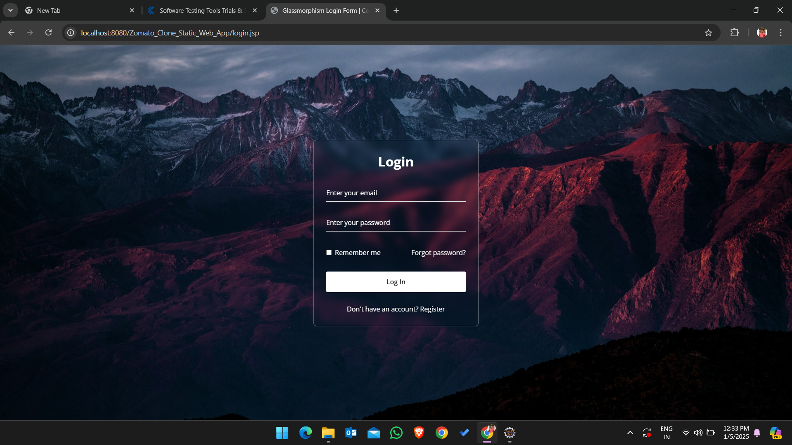
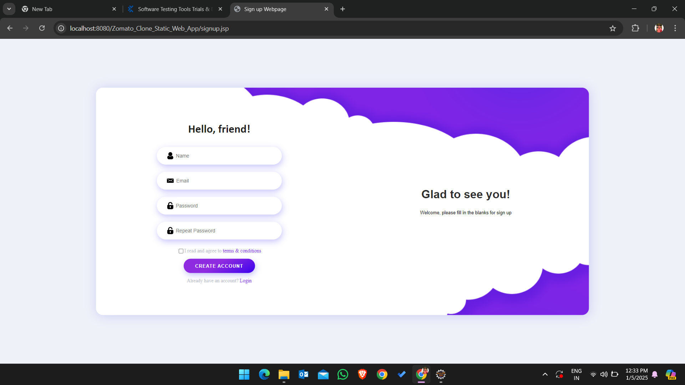

## Zomato-clone : Currently under the Developement phase - yet to be updated, stay tuned! 

1. Key Features of Zomato Clone
   - Home Page: Display a search bar for restaurants, a list of restaurants, categories (e.g., cuisine type), and promotions.
   - Restaurant Listings: Show a list of restaurants with details like name, rating, location, and cuisine.
   - Restaurant Profile: Detailed restaurant page showing menu items, photos, reviews, and ratings.
   - Search Functionality: Users can search for restaurants by location, cuisine, or name.
   - User Registration/Login: Users can create an account and log in to place orders, review restaurants, and save favorites.
   - Admin Panel: For managing restaurants, users, and orders.
   - Reviews and Ratings: Users can leave reviews and rate restaurants.
   - Order Functionality: Users can place orders directly through the app.

2. Tech Stack Recommendation
    - Front-End:
       - HTML/CSS/JavaScript: Basic structure and styling of the website.
       - React.js or Vue.js: For building interactive and dynamic components.
       - Bootstrap or Tailwind CSS: For responsive design and components.
    - Back-End:
       - Node.js with Express.js: For building the server-side application and APIs.
       - MongoDB or MySQL: For storing user data, restaurant data, orders, reviews, etc.
       - JWT (JSON Web Token): For user authentication (login/signup).
    - Others:
      - Cloud Hosting (e.g., Heroku, AWS, DigitalOcean): For deploying the application.
      - Stripe/PayPal API: For integrating payment gateways.

3. Database Schema (MongoDB Example)
a. Users Collection
```
{
  "_id": ObjectId,
  "name": "John Doe",
  "email": "john@example.com",
  "password": "hashed_password",
  "role": "user/admin",  // Determines access rights
  "favorites": [restaurant_ids],  // Array of favorite restaurant IDs
  "orders": [order_ids]  // Array of past orders
}
```
b. Restaurants Collection
```
{
  "_id": ObjectId,
  "name": "Pizza Hut",
  "location": "New York",
  "rating": 4.5,
  "cuisine": "Italian",
  "menu": [
    { "item_id": ObjectId, "name": "Margherita Pizza", "price": 10.00 },
    { "item_id": ObjectId, "name": "Pasta", "price": 12.00 }
  ],
  "reviews": [
    { "user_id": ObjectId, "rating": 5, "comment": "Great pizza!" }
  ],
  "hours": {
    "open": "9:00 AM",
    "close": "11:00 PM"
  },
  "images": [ "image_url1", "image_url2" ]
}
```
c. Orders Collection
```
{
  "_id": ObjectId,
  "user_id": ObjectId,
  "restaurant_id": ObjectId,
  "order_items": [
    { "item_id": ObjectId, "quantity": 2, "total_price": 20.00 }
  ],
  "status": "pending/accepted/delivered",
  "total_amount": 40.00,
  "payment_status": "paid/unpaid",
  "order_time": "2024-12-01T12:00:00Z"
}
```
4. Front-End Development
a. Home Page (HTML)
```
<!DOCTYPE html>
<html lang="en">
<head>
  <meta charset="UTF-8">
  <meta name="viewport" content="width=device-width, initial-scale=1.0">
  <title>Zomato Clone</title>
  <link rel="stylesheet" href="styles.css">
</head>
<body>
  <header>
    <nav>
      <ul>
        <li><a href="/">Home</a></li>
        <li><a href="/restaurants">Restaurants</a></li>
        <li><a href="/login">Login</a></li>
      </ul>
    </nav>
  </header>
  
  <main>
    <section class="search-section">
      <input type="text" id="search-bar" placeholder="Search for restaurants, cuisines...">
      <button id="search-btn">Search</button>
    </section>

    <section class="restaurant-listing">
      <h2>Featured Restaurants</h2>
      <div class="restaurant-cards">
        <!-- Dynamically load restaurant data here -->
        <div class="restaurant-card">
          
          <h3>Pizza Hut</h3>
          <p>Italian Cuisine</p>
          <p>Rating: 4.5/5</p>
        </div>
        <!-- More restaurants -->
      </div>
    </section>
  </main>
  
  <footer>
    <p>© 2024 Zomato Clone</p>
  </footer>

  <script src="app.js"></script>
</body>
</html>
```
b. Search Functionality (JavaScript)
```
document.getElementById("search-btn").addEventListener("click", function() {
  const query = document.getElementById("search-bar").value;
  fetch(`/api/search?query=${query}`)
    .then(response => response.json())
    .then(data => {
      console.log(data);
      // Render restaurant data dynamically
    });
});
```
5. Back-End Development (Node.js + Express.js)
a. Setting Up Express Server
```
const express = require('express');
const app = express();
const mongoose = require('mongoose');
const bodyParser = require('body-parser');

app.use(bodyParser.json());

// Connect to MongoDB
mongoose.connect('mongodb://localhost:27017/zomato-clone', {
  useNewUrlParser: true,
  useUnifiedTopology: true,
});

// Sample API to fetch restaurant listings
app.get('/api/restaurants', (req, res) => {
  Restaurant.find()
    .then(restaurants => res.json(restaurants))
    .catch(err => res.status(400).json('Error: ' + err));
});

// API to search for restaurants
app.get('/api/search', (req, res) => {
  const query = req.query.query;
  Restaurant.find({ name: new RegExp(query, 'i') })
    .then(results => res.json(results))
    .catch(err => res.status(400).json('Error: ' + err));
});

// Start server
app.listen(5000, () => {
  console.log('Server is running on port 5000');
});
```
b. API Routes
```
GET /api/restaurants: Fetch a list of restaurants.
GET /api/search?query=...: Search restaurants by name, cuisine, or location.
POST /api/orders: Create a new order.
POST /api/login: Authenticate users.
```
6. Admin Panel (Optional)

For managing restaurants and users, create an Admin Dashboard where you can add, update, and delete restaurant details, manage user reviews, and track orders.

7. Deployment

    - Back-End: Host your Node.js app on platforms like Heroku, AWS, or DigitalOcean.
    - Front-End: Host static assets (HTML/CSS/JS) on Netlify, Vercel, or GitHub Pages.
    - Database: Use MongoDB Atlas for cloud-hosted MongoDB or AWS RDS for MySQL.
8. Additional Features

- Real-Time Order Tracking: Use Socket.io to update users in real-time about the status of their orders.
- Payment Integration: Integrate Stripe or PayPal to handle payments.
Social Media Authentication: Allow users to log in using Google or Facebook.


### Zomato Clone : Track Developement

- **Homepage**: The main page of the Zomato clone.
  )

- **Login Page**: The login interface for the Zomato clone.
  

- **Register User**: The registration page for new users in the Zomato clone.
  


